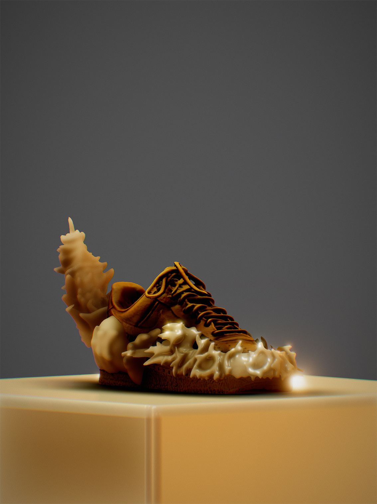
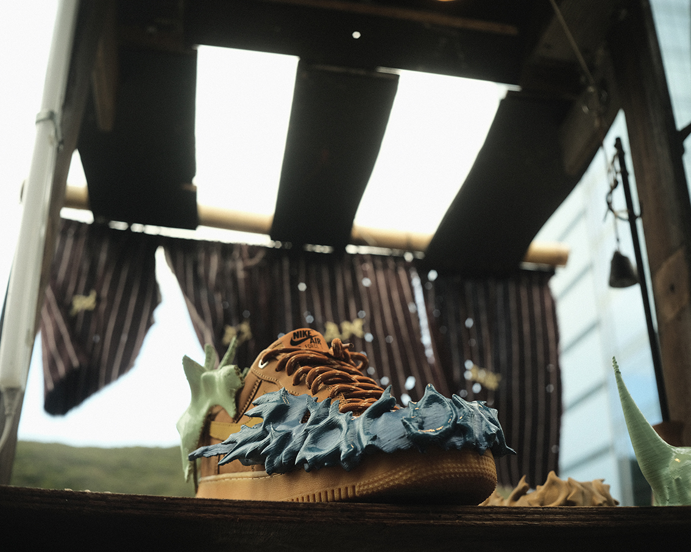
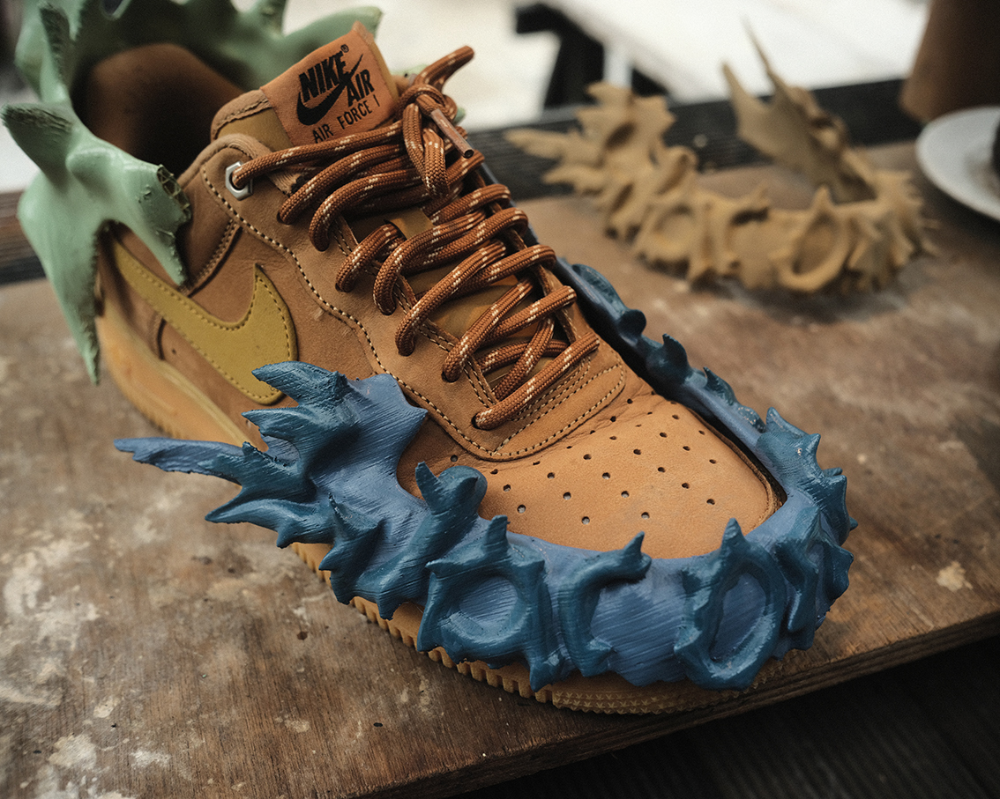
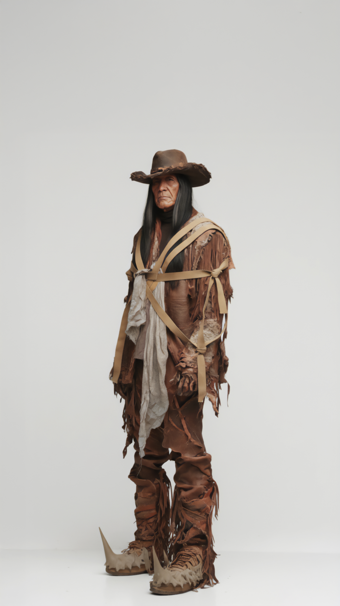
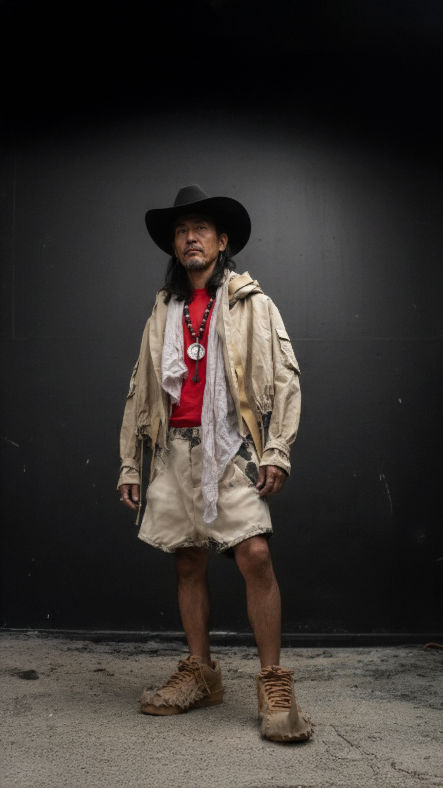

# System-Reboot
A digital rebellion against fast fashion. War on culture is a movement to reclaim creative autonomy. This repository hosts open-source 3D files and paper patterns to empower a new generation of designers and makers. Starting with downloadable attachments for the Nike AF1.

What's in this Repository:

This repository contains a downloadable .stl file for the first project, designed for 3D printing.

How to Use:

The file is initially scaled for a US size 9 Nike AF1. You will need to scale the model up or down to fit your own shoe size.

The method of attaching the design to your shoe is a creative challenge left up to you!

Contribute to the Project:

An open-source project from "War on culture". If you are willing, we encourage you to share your updated, scaled files and attachment designs back to the project. This is how we can collaboratively build a new fashion system, one season at a time.

